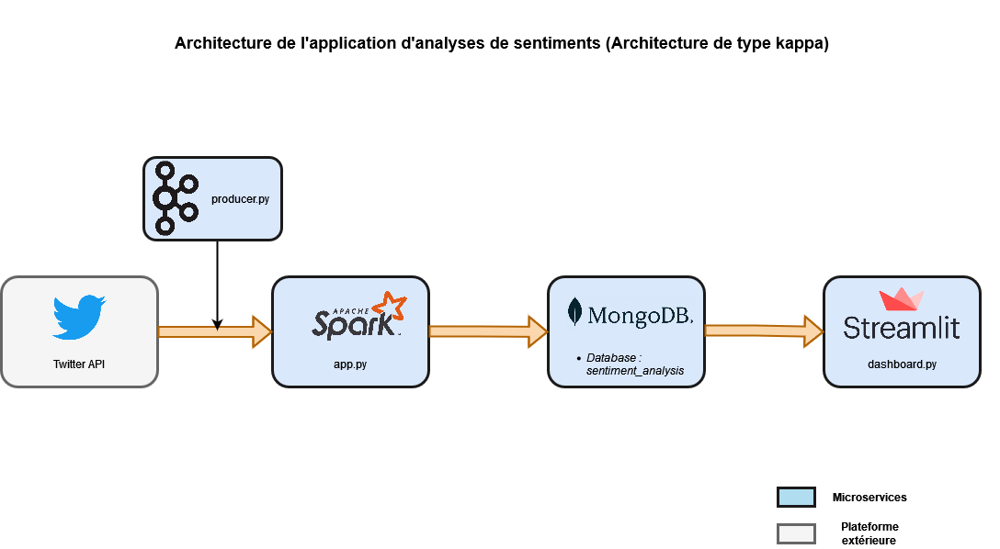

# Sentiment Analysis with Twitter

## Table of contents
* [General info](#general-info)
* [Technologies](#technologies)
* [Setup](#setup)
* [Status](#status)
* [Credits](#credits)
## General Info

The application collects tweets coming from Twitter. The relevant topic is about climate changes. The results are presented in a dashboard realized with Streamlit. 

The project is based on a big data architecture in real-time. The schema of this architecture is introduced below.



## Technologies

This project is created with:

- [API Twitter](https://developer.twitter.com/en/docs/twitter-api)
- [Apache Kafka](https://kafka.apache.org/documentation/)
- [Apache Spark](https://spark.apache.org/)
- [Docker](https://www.docker.com/)
- [MongoDB](https://www.mongodb.com/)
- [Streamlit](https://streamlit.io/)
- [vaderSentiment](https://vadersentiment.readthedocs.io/en/latest/)
## Setup

1) Clone the repository in your computer.
2) Run this project:
```
docker-compose up 
```
3) Access to the dashboard in your browser:
```
localhost:8501
```

## Status

- v1 : Working

## Credits

- Aurélien Blanc
- Cécile Guillot
- Matthieu Cavaillon