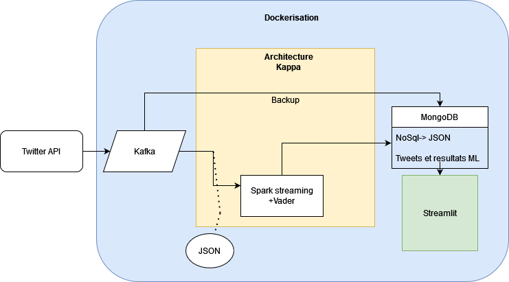

# Sentiment Analysis with Twitter
***
## Objectif du projet

Ce projet à pour objectif la mise en place d'une application qui permet la récupération de tweets en temps réels par le biais de l'API Tweeter. L'objectif est de stocker ces tweets dans une base de donnée MongoDB et d'effectuer de l'analyse de sentiment  Pour celà on utilisera les outils suivants:
- API Tweeter
- Kafka
- Spark
- MongoDB
- vaderSentiment
- Streamlit
***
## Choix de l'architecture

Pour ce projet nous avons choisi d'utiliser une architecture kappa. Ce choix permet de traiter les tweets en temps réel tout en gardant une trace des tweets originaux dans une autre collection de notre base de donnée.

Les tweets sont tout d'abors récupérés via l'api puis distribués à la base de donnée et à l'algorithhme de machine-learning via le consumer kafka.
On obtient ainsi une seule application spark qui s'occupe de la partie machine learning. On évite ainsi la présence d'une deuxième application spark chargée uniquement de diriger les tweets vers notre base de donnée. Ainsi notre application gagne en rapidité.

Une fois les tweet néttoyés et analysés par notre algoryhtme, les informations sont stockées à leur tour dans une collection et peuvent être analysées en temps réelle vià un dashboard Streamlit.
***
## Schéma de l'architecture

